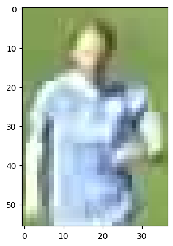

# Football Analysis
## Analysing Football Matches using YOLO for object detection , ByteTrack for tracking players, ball and referees and using Kmeans ans SigLip for Team Classification

## Team classification

#### First the crops of players are taken using opencv and detection boxes in prediction by YOLO Model

#### Then First the background and torso is separated by using KMeans
|  |  |
|:--:|:--:|
| **Before Kmeans** | **After clustering background and player torso** |

#### Then the colors of tshirts are clustered into two separate teams

## How to run:
- pip install requirements.text
- download models from models/
- python -i {input_video_path} -o {output_path} -r {results_path}
- results are saved as parquet
- Output frames and videos are saved in Output Path

## Upcoming:  
    - Adding a Radar View using mplsoccer pitch.

|  |  |
|:--:|:--:|

    - Calculating statistics like player movements speed, passing, types of passes.
    - Producing Heatmaps and other useful Visualisations.
